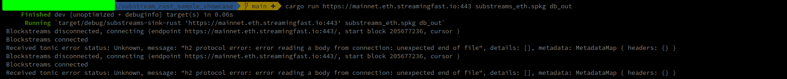

SPKG is downloaded from here:
https://github.com/streamingfast/substreams-eth-block-meta/releases/tag/v0.5.1

## Setup/ETH

1. `cargo build`
2. `cargo run https://mainnet.eth.streamingfast.io:443 substreams_eth.spkg db_out`

# Setup/SOL
1. `cargo run mainnet.sol.streamingfast.io:443 substreams_sol.spkg map_sa_trades`
2. `cargo run mainnet.sol.streamingfast.io:443 substreams_sol.spkg db_out`

## Sample output

